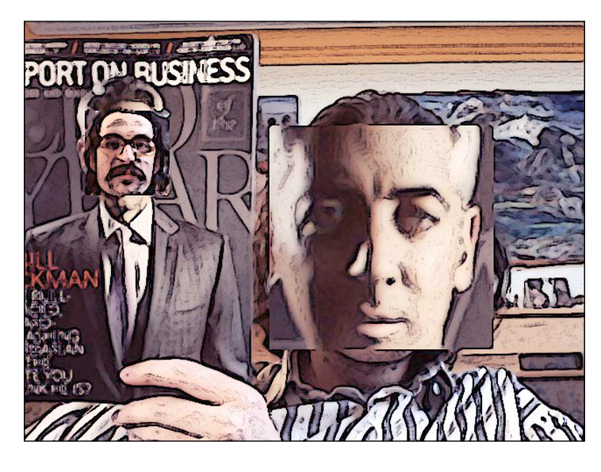

# Cameo

### Add filters to a video stream from a webcam using Cameo!

***To Start***: Run cameo.py in python 3

### Controls:
* **space**: Take a screenshot
* **tab**: Start/stop recording a screencast
* **x**: Start/stop drawing debug rectangles around faces
* **escape**: Quit

### Filters:
* **recolorRC**: view image in Red Cyan colorspace
* **recolorRGV**: view image in Red Green Value colorspace
* **recolorCMV**: view image in Cyan Magenta Value colorspace
* **BGRPortraCurveFilter**: view image as Porta film
* **BGRProviaCurveFilter**: view image as Provia film
* **BGRVelviaCurveFilter**: view image as Velvia film
* **BGRCrossProcessCurveFilter**: view image as Cross-Processed film
* **strokeEdges**: view image with highlighted edges
* **SharpenFilter**: a filter that sharpens the image
* **BlurFilter**: a filter that blurs the image
* **EmbossFilter**: a filter that embosses the image

***To change filter:*** Change line 13 in cameo.py to the filter of your choice. If no changes are made, the BGRPortraCurveFilter is being used.

### If there are two people present in the image they will switch faces.

